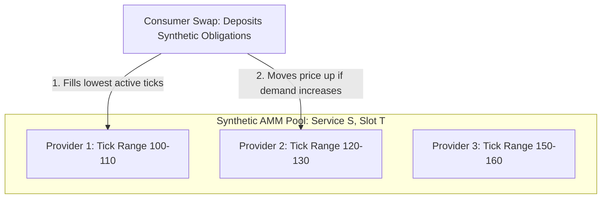
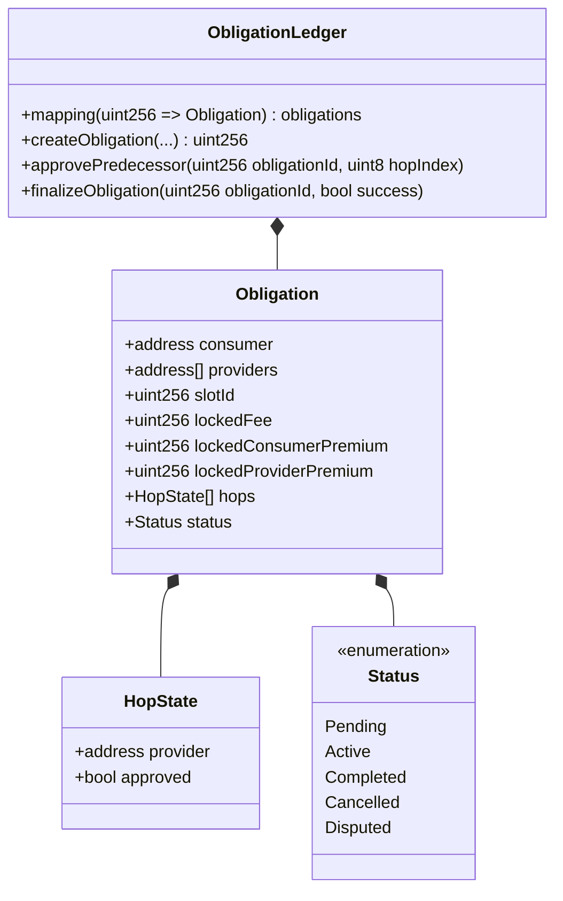

# The Economics of the Real World Services (RWS) Protocol

## Abstract
As the global economy transitions from asset ownership to service-based subscription models, blockchain paradigms must adapt from tokenizing static Real World Assets (RWAs) to orchestrating dynamic **Real World Services (RWS)**. This paper presents the economic and architectural design of the RWS protocol: a service-agnostic, B2B-gated backbone. The protocol utilizes a Uniswap v4-like singleton architecture to swap synthetic service tokens, separating pricing and routing from asset custody. By holding stablecoins in a central Treasury and utilizing a shared Capacity Registry, the protocol eliminates capital lockup. This spec details the mechanics of **Service- and Datetime-Specific Pools** for multi-provider price exploration, the **Dual-Premium Lock** mechanism, and the **Obligation Ledger** workflow.

---

## 1. Introduction: From RWA to RWS
The prevailing blockchain narrative surrounding Real World Assets (RWAs) focuses heavily on static tokenization—fractionalizing real estate, gold, or treasury bills. However, modern enterprise commerce is dominated by **services and subscriptions**. Services are inherently dynamic, time-bound, and capacity-constrained. 

Tokenizing a service requires representing the *future obligation* of a provider to perform, and the *capacity* of that provider to deliver within specific timeframes. Designing a blockchain framework for services requires addressing three core challenges:
1.  **Capital Efficiency**: Traditional automated market makers (AMMs) lock massive amounts of capital (e.g., stablecoins) to facilitate trades, which is highly inefficient for service contracts that have long lead times before execution.
2.  **Double-Booking (Double-Spending of Time)**: A single unit of physical capacity (e.g., an engineer's hour or a rental car's day) can back multiple distinct service offerings, but only one can be executed.
3.  **Trust & Verification**: Resolving whether a real-world service was completed without relying on expensive, centralized, or brittle third-party oracles.

The RWS Protocol solves these problems by acting as a generic, service-agnostic backbone that separates **pricing/routing** (handled synthetically) from **custody/settlement** (handled by a central treasury and obligation ledger), governed by a B2B-gated reputation network.

---

## 2. The Capacity Ledger & Shared Capacity Constraints

At the core of the RWS Protocol is the definition of **Capacity** as the primary economic primitive. Unlike traditional tokens, capacity is a multi-dimensional asset defined by:
*   **Provider ($P$)**: The entity delivering the service.
*   **Time Slot ($T$)**: The specific window during which the capacity is valid.
*   **Service Class ($S$)**: The type of service being offered.

### Semi-Fungible Tokens (SFTs)
Capacity is represented using Semi-Fungible Tokens (such as the ERC-3525 standard). The SFT model is uniquely suited for services because it allows tokens to share a common "slot" (representing a specific time frame or resource) while holding individual "values" (representing the quantity of capacity).

### Market Fragmentation & The Shared Capacity Constraint
A major challenge in service economics is **market fragmentation**. A service provider might expose their single unit of physical capacity under multiple different service listings to capture different market segments (e.g., an hour of labor listed as either "Backend Development" or "Consulting"). 

If these services are traded in separate pools, a booking in one must immediately reduce the available capacity in the other. To solve this, the RWS protocol implements a global **Capacity Registry**. When a synthetic swap occurs for any market-fragmented service token, the pool queries the shared Capacity Registry. If the underlying capacity for that time slot is already consumed, the swap is blocked. This prevents double-booking without requiring complex, cross-pool liquidity migrations.

---

## 3. Service- and Datetime-Specific Pools (Multi-Provider Pricing)

To enable true market efficiency and price discovery, **pools are specific to a single service and time slot, but independent of specific providers**. 
A pool is initialized for the tuple `(Service S, TimeSlot T)`.

### Multi-Provider Concentrated Liquidity
Because multiple providers place their capacity for the same service and slot into a single pool, the pool functions as a competitive order book:
1.  **Tick Range Competition**: Providers act as LPs by placing their capacity tokens at specific tick ranges corresponding to their asking price. For example, a low-cost provider might place their capacity in the $\$100-\$110$ range, while a premium provider places theirs at $\$120-\$130$.
2.  **Price Exploration**: When a consumer swaps synthetic obligation tokens for capacity, the swap is automatically executed against the cheapest active tick ranges first. As demand for `Slot T` increases, the pool price moves up the curve, matching against higher-priced provider ranges.
3.  **No Capital Lockup**: There are no real stablecoins locked in these pools.
4.  **No Liquidity Fragmentation Penalty**: In public DeFi, splitting liquidity across thousands of datetime-specific pools would cause extreme slippage and make trading impossible. In RWS, since the pools are synthetic, one-sided, and B2B-controlled, there is no real-capital fragmentation. Prices are set deterministically by the provider's hooks or direct quotes, bypassing the classic AMM slippage problem entirely.

---

## 4. The Dual-Premium Lock Mechanism

Many real-world services require financial protection for both parties during the service period (e.g., car renting, hotel booking, equipment leasing). The protocol native supports a **Dual-Premium Lock** executed inside the Treasury:

*   **Consumer Premium (Security Deposit)**: The consumer locks additional stablecoins (beyond the service fee) to cover potential real-world damages, overages, or late returns.
*   **Provider Premium (SLA Guarantee)**: The provider locks stablecoins to guarantee availability and performance quality. If the provider defaults or fails to show up, this premium can be slashed to compensate the consumer.

### Economic Flow of Premiums
1.  **Locking**: At the time of booking, both premiums are deposited into the Treasury and recorded under the corresponding Synthetic Obligation.
2.  **Successful Completion**: When the service finishes normally, the provider gets the service fee + their provider premium, and the consumer gets their consumer premium back.
3.  **Disputed Failures**: If a dispute arises (e.g., damage to a rental car, or service non-delivery), the business layer/oracle determines the allocation. If the consumer damaged the car, a portion of the consumer premium is awarded to the provider. If the provider failed to deliver, their premium is awarded to the consumer.

---

## 5. How the Obligation Ledger Works

The **Obligation Ledger** is the state database managed by the core singleton contract. It acts as a decentralized escrow and workflow registry.

### Detailed Lifecycle of an Obligation in the Ledger

#### 1. Registration Phase (Atomic Swap & Lock)
When a service route is initiated:
*   The off-chain router pushes the calculated route data (hops, fees, and required premiums) to the singleton.
*   The consumer and provider transfer stablecoins to the Treasury.
*   The registry records a new `Obligation` entry in storage, generating a unique `obligationId`. 
*   A **Synthetic Obligation Token (SFT)** is generated containing the `obligationId` as its token ID.

#### 2. The Multi-Hop Verification Flow
For sequential services (e.g., `Provider A` $\rightarrow$ `Provider B` $\rightarrow$ `Provider C`), the ledger tracks individual hops:
*   `Provider A` performs. When finished, they deliver their output to `Provider B`.
*   `Provider B` calls `approvePredecessor(obligationId, hopIndex)`.
*   The Ledger updates the state of `HopState[0]` to `approved`.
*   **Intermediate Release**: The protocol immediately releases `Provider A`'s locked fee and provider premium. This is possible because the singleton's state logic is decoupled from the final completion, freeing `Provider A`'s capital immediately.

#### 4. Finalization Phase
*   When the final hop (or the entire service) completes, the validation source (the consumer or business oracle) calls `finalizeObligation(obligationId, success)`.
*   **On Success**:
    *   The remaining fee is released to the final provider.
    *   The consumer's premium is returned to the consumer.
    *   The Synthetic Obligation Token is **burned**.
    *   The ledger entry status is updated to `Completed`.
*   **On Dispute/Failure**:
    *   The dispute resolution hook determines the distribution of fees and premiums.
    *   The Synthetic Obligation Token is burned, and the ledger entry status is updated to `Disputed` or `Cancelled`.

---

## 6. Coherence Audit & Edge-Case Analysis

### Coherence Check: Downstream Failure in Multi-Hop Chains
**Scenario**: In a sequential route `A -> B -> C`, `Provider A` successfully completes their hop. `Provider B` approves `A`'s work, which releases `A`'s fee and premium. However, `Provider B` subsequently fails to deliver their own service.

*   **How the Ledger Resolves This**:
    1.  `Provider B`'s failure is registered (either through timeout or oracle assertion).
    2.  `Provider B`'s locked provider premium is slashed and sent to the consumer to compensate for the broken service chain.
    3.  The remaining unspent fees for `B` and `C` are refunded to the consumer from the Treasury.
    4.  The transaction is terminated, and `Provider B` is flagged for platform expulsion (banning) in the B2B gated layer.
*   **Coherence Verdict**: Coherent. `Provider A` is compensated for completed work, the consumer is compensated for the failure via `B`'s slashed premium, and the bad actor is expelled.

### Coherence Check: Parallel Hop Finalization
**Scenario**: Services `A` and `B` run in parallel. `Service C` depends on both. `A` completes in 2 hours, while `B` takes 10 hours.

*   **How the Ledger Resolves This**:
    Since the ledger supports individual hop tracking, `Provider C` (or the validation contract) can call `approvePredecessor()` for `A` as soon as `A` completes. This releases `A`'s capital immediately after 2 hours, without waiting for the 10-hour mark of `B`.
*   **Coherence Verdict**: Coherent. Capital efficiency is preserved at the individual hop level.

---

## 7. Conclusion
The RWS Protocol represents a highly optimized paradigm for the on-chain service economy. By leveraging a singleton structure, the protocol achieves gas-efficient multi-hop routing. By separating the AMM pricing engine into synthetic, datetime-specific pools and utilizing a central Treasury, it maximizes capital efficiency. Finally, by mapping capacity to a shared registry, executing dual-premium locks, and managing escrow states within the Obligation Ledger, it provides a robust, double-booking-proof foundation for complex real-world workflows.
